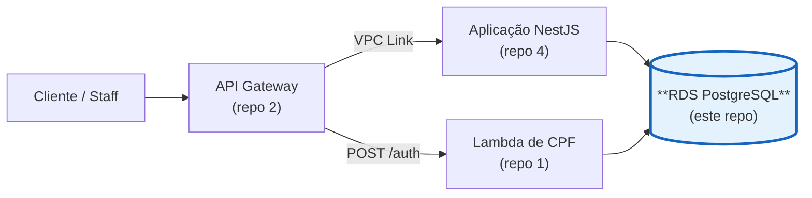
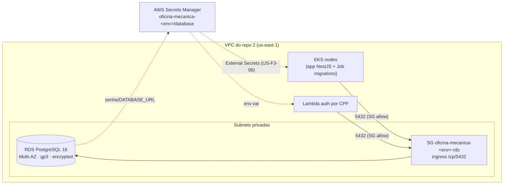

# soat-fiap-oficina-infra-db

[](https://github.com/guilhermeqmaia/soat-fiap-oficina-infra-db/actions/workflows/ci.yml) [](https://github.com/guilhermeqmaia/soat-fiap-oficina-infra-db/actions/workflows/cd.yml)

Terraform do **banco de dados gerenciado** do Sistema da Oficina Mecânica
(Tech Challenge FIAP — Fase 3): **Amazon RDS for PostgreSQL** Multi-AZ, com
subnet group, security group e segredo de conexão. Repositório **3/4** da
solução.

| # | Repositório | Conteúdo |
|---|---|---|
| 1 | [soat-fiap-oficina-auth-lambda](https://github.com/guilhermeqmaia/soat-fiap-oficina-auth-lambda) | Function serverless de autenticação por CPF |
| 2 | [soat-fiap-oficina-infra-k8s](https://github.com/guilhermeqmaia/soat-fiap-oficina-infra-k8s) | Terraform do API Gateway + cluster EKS |
| 3 | **soat-fiap-oficina-infra-db** (este) | Terraform do banco gerenciado (RDS PostgreSQL) |
| 4 | [soat-fiap-oficina-mecanica-app](https://github.com/guilhermeqmaia/soat-fiap-oficina-mecanica-app) | Aplicação NestJS + manifestos K8s + docs |

Implementa a [US-F3-04](docs/user-stories/f3-04-terraform-banco-gerenciado.md);
a justificativa da escolha do banco e o modelo ER são a
[US-F3-DOC-04](docs/user-stories/f3-doc-04-justificativa-banco-er.md).
Passo a passo para rodar no AWS Academy: **[docs/AWS_ACADEMY_SETUP.md](docs/AWS_ACADEMY_SETUP.md)**.

## Onde este repositório entra



**Papel deste repositório:** banco gerenciado **RDS PostgreSQL Multi-AZ**, em
subnets privadas da VPC, com o segredo de conexão no Secrets Manager —
consumido pela aplicação (repo 4) e pela Lambda de autenticação (repo 1).

| Repositório | Papel |
|---|---|
| [1 · auth-lambda](https://github.com/guilhermeqmaia/soat-fiap-oficina-auth-lambda) | emite o JWT (CPF) e valida no gateway |
| [2 · infra-k8s](https://github.com/guilhermeqmaia/soat-fiap-oficina-infra-k8s) | API Gateway, cluster EKS e observabilidade |
| **3 · este repo** | **RDS PostgreSQL gerenciado** |
| [4 · mecanica-app](https://github.com/guilhermeqmaia/soat-fiap-oficina-mecanica-app) | API NestJS, manifestos K8s e documentação |

## Por que PostgreSQL gerenciado (RDS)

- Mantém o **mesmo dialeto e migrations** (Prisma) das Fases 1–2 — zero
  reescrita na aplicação.
- ACID para as transações do domínio (ordens de serviço, reservas de estoque).
- Multi-AZ com failover automático, backups e patches gerenciados pela AWS.
- **Justificativa formal** (comparativo com DynamoDB, MySQL, Postgres
  auto-hospedado e Aurora), **diagrama ER**, relacionamentos, constraints e
  índices: [docs/arquitetura/banco-de-dados.md](docs/arquitetura/banco-de-dados.md)
  (US-F3-DOC-04). Fonte do modelo: [docs/schema.dbml](docs/schema.dbml)
  (importável no [dbdiagram.io](https://dbdiagram.io)).

## Arquitetura



Nada é acessível de fora da VPC: `publicly_accessible = false`, subnets
privadas e ingresso liberado **apenas** para os security groups / CIDRs
informados (nodes do EKS + Lambda de auth).

## Recursos criados

| Recurso Terraform | Nome | Função |
|---|---|---|
| `aws_db_instance.this` | `oficina-mecanica-<env>` | Instância RDS PostgreSQL 16, Multi-AZ, gp3, criptografada |
| `aws_db_subnet_group.this` | `oficina-mecanica-<env>-db` | Agrupa as subnets privadas onde a instância vive |
| `aws_security_group.rds` | `oficina-mecanica-<env>-rds` | Firewall da instância (egress default da AWS) |
| `aws_security_group_rule.rds_ingress_sg` | — | Ingresso tcp/5432 por security group (EKS, Lambda) |
| `aws_security_group_rule.rds_ingress_cidr` | — | Ingresso tcp/5432 por CIDR (opcional — ex.: CIDR da VPC) |
| `random_password.db` | — | Senha master (24 chars alfanuméricos), gerada no apply |
| `aws_secretsmanager_secret.db` | `oficina-mecanica-<env>/database` | Segredo de conexão |
| `aws_secretsmanager_secret_version.db` | — | Payload JSON com `DATABASE_URL` + campos de conveniência |

## Contrato de saída (consumido pelos repos 1 e 4)

Segredo `oficina-mecanica-<env>/database` no Secrets Manager, JSON com
**chaves estáveis**:

| Chave | Exemplo |
|---|---|
| `DATABASE_URL` | `postgresql://oficina:***@<endpoint>:5432/oficina_mecanica?schema=public` |
| `DB_HOST` | `oficina-mecanica-homolog.abc123.us-east-1.rds.amazonaws.com` |
| `DB_PORT` | `5432` |
| `DB_NAME` | `oficina_mecanica` |
| `DB_USER` | `oficina` |
| `DB_PASSWORD` | `***` |

O Job de migrations (`prisma migrate deploy`) e a app NestJS leem `DATABASE_URL`
via Secret do K8s (External Secrets, US-F3-06). A Lambda de auth lê o mesmo
segredo. **Nenhuma senha vai para `outputs` nem para logs** — os outputs
expõem só endpoint e ARN/nome do segredo.

## Como aplicar (local)

Pré-requisito: credenciais do AWS Academy ativas (`aws configure` com
`AWS_SESSION_TOKEN`) e o bucket S3 + tabela DynamoDB de state já criados
(bootstrap — ver [docs/AWS_ACADEMY_SETUP.md](docs/AWS_ACADEMY_SETUP.md)).

```bash
cp backend.hcl.example backend.hcl            # preencher bucket/tabela/key
cp terraform.tfvars.example terraform.tfvars  # preencher vpc_id/subnet_ids/SGs (outputs do repo 2)

terraform init -backend-config=backend.hcl
terraform plan
terraform apply
```

Ambientes: use uma `key` diferente por ambiente no `backend.hcl`
(`oficina-infra-db/homolog.tfstate` / `oficina-infra-db/prod.tfstate`) e
`environment = "homolog"|"prod"` no tfvars. O CI/CD já faz isso por branch.

### Recriar a instância

`final_snapshot_identifier` é fixo (`oficina-mecanica-<env>-final-snapshot`).
Se precisar recriar depois de um destroy em prod, apague o snapshot antigo
antes: `aws rds delete-db-snapshot --db-snapshot-identifier <id>`.

## Variáveis

Obrigatórias (sem default):

| Variável | Descrição |
|---|---|
| `environment` | `homolog` ou `prod` — condiciona `deletion_protection`, `skip_final_snapshot`, `apply_immediately` |
| `vpc_id` | VPC do cluster EKS (output do repo 2) |
| `subnet_ids` | ≥ 2 subnets **privadas** em AZs distintas (requisito do Multi-AZ) |

Principais opcionais (defaults em [`variables.tf`](variables.tf)):

| Variável | Default | Descrição |
|---|---|---|
| `aws_region` | `us-east-1` | Região (Learner Lab só opera aqui) |
| `project_name` | `oficina-mecanica` | Prefixo dos nomes |
| `allowed_security_group_ids` | `[]` | SGs com acesso ao Postgres (nodes EKS + Lambda) |
| `allowed_cidr_blocks` | `[]` | CIDRs com acesso ao Postgres (ex.: CIDR da VPC) |
| `engine_version` | `16` | Major do PostgreSQL |
| `instance_class` | `db.t3.micro` | Classe da instância |
| `allocated_storage` / `max_allocated_storage` | `20` / `100` | Storage gp3 + teto do autoscaling |
| `storage_encrypted` | `true` | Criptografia em repouso (`aws/rds`) — `false` só se o lab bloquear KMS |
| `multi_az` | `true` | Standby em outra AZ |
| `backup_retention_period` | `7` | Dias de retenção dos backups automáticos |
| `backup_window` / `maintenance_window` | `03:00-04:00` / `mon:04:30-mon:05:30` | Janelas UTC |
| `deletion_protection` | `null` → `true` em prod | Bloqueia delete da instância |
| `skip_final_snapshot` | `null` → `false` em prod | Snapshot final ao destruir |
| `lab_role_arn` / `enable_enhanced_monitoring` | `""` / `false` | Enhanced Monitoring (exige a LabRole) |

## Custo estimado (us-east-1, on-demand)

| Item | homolog (single-AZ, `multi_az=false`) | prod (Multi-AZ) |
|---|---|---|
| `db.t3.micro` | ~US$ 12,4/mês | ~US$ 24,8/mês (2×) |
| Storage gp3 20 GiB | ~US$ 2,3/mês | ~US$ 4,6/mês (primary + standby) |
| Backups (até 100% do storage) | incluso / ~US$ 0 | incluso / ~US$ 0 |
| Secrets Manager (1 segredo) | ~US$ 0,40/mês | ~US$ 0,40/mês |
| **Total aproximado** | **~US$ 15/mês** | **~US$ 30/mês** |

Sem tráfego entre AZs relevante para a carga do desafio. Valores de
referência — o AWS Academy Learner Lab tem orçamento limitado: **rode
`terraform destroy` ao terminar** cada sessão de trabalho.

## CI/CD (US-F3-08)

| Workflow | Quando | O que faz |
|---|---|---|
| [`ci.yml`](.github/workflows/ci.yml) | PR e push em `main`/`homolog` | `fmt -check` + `validate` sempre; **`terraform plan` comentado no PR** quando há credenciais + `TF_STATE_BUCKET` |
| [`cd.yml`](.github/workflows/cd.yml) | push em `homolog` → homologação, `main` → produção | `terraform apply -auto-approve`; `workflow_dispatch` permite `plan`/`apply`/`destroy` |

State remoto: S3 (`TF_STATE_BUCKET`), chave `oficina-infra-db/<env>.tfstate`,
lock opcional em DynamoDB (`TF_STATE_LOCK_TABLE`).

**Secrets** (Settings → Secrets and variables → Actions → *Secrets*):

| Secret | Uso |
|---|---|
| `AWS_ACCESS_KEY_ID`, `AWS_SECRET_ACCESS_KEY`, `AWS_SESSION_TOKEN` | Credenciais do Learner Lab — **renovar a cada sessão** (`gh secret set`) |
| `TF_STATE_BUCKET` | Bucket S3 do remote state |
| `TF_STATE_LOCK_TABLE` | (opcional) tabela DynamoDB de lock |
| `AWS_ROLE_ARN` | (alternativa OIDC — não usado no Academy) |

**Variables** (mesma tela → *Variables*, viram `TF_VAR_*`):

| Variable | Uso |
|---|---|
| `VPC_ID` | `vpc-...` do cluster EKS (repo 2) |
| `DB_SUBNET_IDS` | JSON: `["subnet-aaa","subnet-bbb"]` (subnets privadas) |
| `DB_ALLOWED_SG_IDS` | JSON: `["sg-eks-nodes","sg-lambda-auth"]` |
| `DB_ALLOWED_CIDRS` | (opcional) JSON: `["10.0.0.0/16"]` |
| `LAB_ROLE_ARN` | (opcional) ARN da LabRole, só se ligar Enhanced Monitoring |
| `AWS_REGION`, `TF_DIR` | (opcionais) região / diretório do Terraform |

Sem esses secrets/vars os jobs de `plan`/`apply` são **ignorados com aviso**
(fmt/validate continuam rodando). Endpoint do RDS e nome do segredo saem no
*summary* do run de CD (`terraform output`) — a senha nunca aparece.

## Qualidade

```bash
terraform fmt -check && terraform init -backend=false && terraform validate
```

## Documentação

- [docs/AWS_ACADEMY_SETUP.md](docs/AWS_ACADEMY_SETUP.md) — runbook do AWS Academy + pipeline
- [docs/user-stories/](docs/user-stories/) — US-F3-04, US-F3-DOC-04
- [docs/qa-plans/QA_PLAN_US-F3-04.md](docs/qa-plans/QA_PLAN_US-F3-04.md) — plano de QA
- [docs/arquitetura/banco-de-dados.md](docs/arquitetura/banco-de-dados.md) — justificativa da escolha do banco, diagrama ER, relacionamentos, consistência e índices
- [docs/schema.dbml](docs/schema.dbml) — modelo ER completo do domínio (fonte canônica do [diagrama](docs/arquitetura/er-diagram.png))
- [docs/tech-challenges/fase-3-tech-challenge.pdf](docs/tech-challenges/fase-3-tech-challenge.pdf) — enunciado
